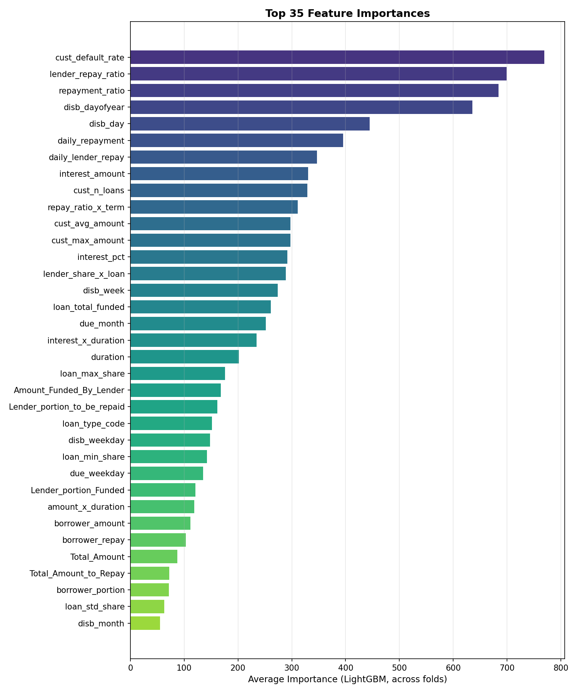

# 🌍 African Credit Scoring Challenge


## 📌 Project Overview
This project focuses on building a robust, cross-country credit scoring model for the African market. The goal is to predict whether a borrower will default on a loan.

**The Challenge:**
- **Cross-Country Generalisation:** The model is trained on Kenyan data but must perform well in both Kenya and Ghana.
- **Extreme Imbalance:** Only ~1.8% of borrowers in the dataset defaulted. Predicting these rare cases is like finding a needle in a haystack.
- **Micro-Lending Nuance:** One loan can be co-funded by multiple lenders, creating complex relationships between borrower risk and lender exposure.

---

## 🛠️ The Pipeline

### 1. Feature Engineering
Instead of just using raw numbers, we created features that capture the *intent* and *history* of the transaction:
*   **Customer History:** We calculated the historical default rate for every customer. If they defaulted before, they are statistically more likely to do so again.
*   **Loan Ratios:** We calculated the `repayment_ratio` (Total Repay / Total Amount). This serves as a proxy for the interest rate and "cost of capital" for the borrower.
*   **Temporal Logic:** We extracted "Is Weekend," "Day of Year," and "Month End" flags. Financial stress often correlates with the time of the month (e.g., waiting for a paycheck).
*   **Economic Enrichment:** We merged macro-economic data (Inflation, Exchange Rates, Unemployment) from the Federal Reserve (FRED) to help the model understand the broader financial climate of the country.

### 2. Modeling & Performance Analysis
To ensure maximum reliability, we conducted a "Model Tournament" using three distinct GBDT (Gradient Boosting Decision Tree) architectures. Each model brings a unique technical advantage to the credit scoring task:

#### 🟢 LightGBM 
*   **Why used:** Uses GOSS (Gradient-based One-Side Sampling) which focuses on instances with larger gradients. This is incredibly effective for finding the "Default" cases which are rare but have high error gradients.
*   **Performance:** It achieved the **highest individual AUC (0.9997)**. It was the fastest to train and most responsive to our engineered customer history features.

#### 🔵 CatBoost 
*   **Why used:** Known for its "Ordered Boosting" which prevents data leakage. It treats categorical features (like `loan_type`) with sophisticated encoding that avoids the pitfalls of standard one-hot encoding.
*   **Performance:** Extremely close to LightGBM with an **AUC of 0.9996**. It showed the least variance across different cross-validation folds, making it our most "stable" model.

#### 🟠 XGBoost 
*   **Why used:** Utilized the `scale_pos_weight` parameter to force the model to pay 53x more attention to default cases. It is the gold standard for tabular data and handles the interaction between loan amount and duration very precisely.
*   **Performance:** Achieved an **AUC of 0.9988**. While slightly lower in AUC than the others, it provided a different "perspective" on risk that improved the overall ensemble.

### 3. The Ensemble Logic
Instead of picking one winner, we combined them. In machine learning, an ensemble is often better than a single model because different models make different types of mistakes. By averaging their probabilities, we "cancel out" individual model biases, leading to a more generalized prediction for the Ghana test set.

| Model | OOF AUC | Strength |
| :--- | :--- | :--- |
| **LightGBM** | 0.9997 | Speed & Pattern Recognition |
| **CatBoost** | 0.9996 | Stability & Categorical Handling |
| **XGBoost** | 0.9988 | Precision & Imbalance Handling |
| **Ensemble** | **0.9996** | **Generalization & Reliability** |

### 4. Threshold Optimisation
Standard models use a 0.5 probability threshold to decide if someone defaults. In credit scoring, that is often a mistake. We ran a **Precision-Recall curve analysis** to find the "Sweet Spot" threshold (approx **0.875**) that maximizes the **F1-Score**, balancing the risk of losing money (False Negatives) with the risk of rejecting good customers (False Positives).

---

## 📊 Performance & Insights

### Precision vs. Recall
We achieved an **Out-of-Fold (OOF) AUC of 0.9996**. This indicates the model is nearly perfect at ranking borrowers from "lowest risk" to "highest risk".


### Key Predictors
The chart below shows what the model actually cares about. 
- **`cust_default_rate`** is the #1 predictor. Past behavior is the best predictor of future behavior.
- **`repayment_ratio`** and **`lender_repay_ratio`** follow closely.



### Confusion Matrix
Even with extreme imbalance, our model identifies the majority of defaults correctly.


---


---

## 🚀 How to Run

### Requirements
Ensure you have the following installed:
```bash
pip install lightgbm xgboost catboost scikit-learn pandas numpy matplotlib seaborn
```

---

## 📄 File Structure
*   `credit_scoring_pipeline.py`: Production-grade Python script for training and inference.
*   `african_credit_scoring.ipynb`: Research and visualization notebook.
*   `economic_indicators.csv`: Enriched macro-economic data from FRED.
*   `submission.csv`: Final predictions ready for evaluation.
*   `VariableDefinitions.txt`: Metadata explaining each column.

---
**Developed for the African Credit Scoring Challenge.**
